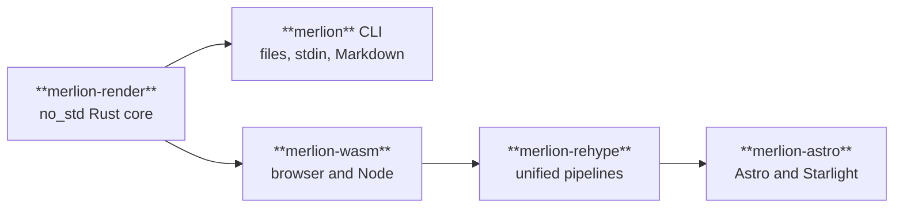
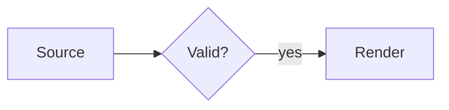

Merlion ships four ways in, all over the same core and all producing the same bytes for the same input: the `merlion` CLI, the `@fractalboxdev/merlion-wasm` module, the `@fractalboxdev/merlion-rehype` plugin and the `@fractalboxdev/merlion-astro` integration. The npm packages are workspace packages of the repository and are not yet published, so every command below runs from a checkout.



## CLI

```sh
cargo build --release -p merlion-cli
echo 'flowchart LR
  a[Source] --> b{Valid?} -->|yes| c[Render]' | target/release/merlion render > diagram.svg
target/release/merlion render docs/page.md -o out/      # every ```mermaid block of a Markdown file
target/release/merlion check diagram.mmd --fix          # apply the parser's repairs to the file
target/release/merlion render diagram.mmd --json        # {svg, outline, diagnostics, fuel_used, error}
```

The first render writes this diagram:



- Re-rendering onto an existing output file uses it as the layout hint, so nodes keep their positions across edits ([Stable layout](/guides/stable-layout/)); `--no-hint` lays out from scratch.
- A Markdown input renders every ```` ```mermaid ```` block; block `n` of `page.md` lands in `out/page-n.svg`.
- `--font embed` inlines an Inter subset for standalone files; the default, `link`, expects the page to load `merlion-font.css` ([Theming](/guides/theming/#fonts)).
- Exit codes: `0` rendered, `1` failed, `2` usage error, `3` input over a limit ([Diagnostics](/guides/diagnostics/)).

## Stylesheet

```sh
target/release/merlion css site.css -o site.compiled.css  # page CSS: literal values, fixed selector shapes
target/release/merlion render d.mmd --css site.css --theme dark -o d.svg  # bake one theme into a standalone SVG
```

A stylesheet is a CSS subset that sets `--merlion-*` tokens for themes and roles. A page links only the compiled CSS; a standalone SVG carries the theme's literals baked in, so GitHub image embeds and librsvg draw it too. [Roles and stylesheets](/guides/roles-and-stylesheets/) covers the subset, and [the stylesheet flow](/how-it-works/stylesheet/) shows the compile and bake paths.

## WebAssembly

```sh
sh packages/merlion-wasm/scripts/build-wasm.sh          # writes packages/merlion-wasm/merlion.wasm
```

```js
import { readFileSync } from "node:fs";
import { initSync, render } from "@fractalboxdev/merlion-wasm";

initSync(readFileSync(new URL("./node_modules/@fractalboxdev/merlion-wasm/merlion.wasm", import.meta.url)));
const { svg, diagnostics } = render("flowchart LR\n  a --> b\n", { width: 640, idPrefix: "d1" });
```

In a browser, `await init()` fetches `merlion.wasm` next to the module. `render` is synchronous after initialisation and bounded by fuel, not by a clock; for source the page does not control, run it in a Web Worker through the package's `worker.js`. Options and result shapes are in `packages/merlion-wasm/index.d.ts`, the JavaScript contract every package follows. The [playground](/playground/) runs this module in the page.

## rehype

```js
import { unified } from "unified";
import remarkParse from "remark-parse";
import remarkRehype from "remark-rehype";
import rehypeStringify from "rehype-stringify";
import rehypeMerlion from "@fractalboxdev/merlion-rehype";

const html = await unified()
  .use(remarkParse)
  .use(remarkRehype)
  .use(rehypeMerlion, { width: 720, cacheDir: ".merlion", fontCss: true })
  .use(rehypeStringify, { allowDangerousHtml: true })
  .process("```mermaid\nflowchart LR\n  a --> b\n```\n");
```

Each ```` ```mermaid ```` block becomes a `<figure>` holding the inline SVG inside `<merlion-view>`, a `<figcaption>` from `accTitle` or the front-matter `title`, and the source in a collapsed `<details>`. A block that fails to parse stays a code block and its diagnostics land on the vfile. `width=<px>` after the language in the fence (```` ```mermaid width=1600 ````) sets that block's container width. `cacheDir` keeps each block's previous render as its layout hint; the stored SVG is never inlined. With `stylesheet: "diagram.css"` the plugin compiles the stylesheet once per build and exposes the page CSS as `file.data.merlion.css`.

## Astro

```js
// astro.config.mjs
import { defineConfig } from "astro/config";
import merlion from "@fractalboxdev/merlion-astro";

export default defineConfig({
  integrations: [merlion({ stylesheet: "src/styles/diagrams.css" })],
});
```

The integration registers the plugin with the configured Markdown processor: Astro 7's default Sätteri processor and `unified()` both get it at the front of their plugin list, so it claims mermaid blocks before a code highlighter such as Starlight's Expressive Code; Astro 5 and 6 read `markdown.rehypePlugins`. It imports `merlion-themes.css` and `merlion-font.css` on every page, compiles `stylesheet` once per build and imports the result after the theme tokens, and loads `<merlion-view>` only on pages that contain a diagram. Diagnostics go to the Astro logger with the Markdown file's line and column.

This site is built that way. `docs/astro.config.mjs` registers the integration after Starlight with `stylesheet: "src/styles/diagrams.css"`, which maps Merlion's roles onto Starlight's colours; every diagram on the site, [the specs](/reference/specs/) included, is a ```` ```mermaid ```` block rendered at build time.

## Next

- [Theming](/guides/theming/): tokens, `data-theme`, per-container variables.
- [Roles and stylesheets](/guides/roles-and-stylesheets/): classes as roles, the stylesheet subset.
- [How it works](/how-it-works/architecture/): the pipeline and every layout phase, drawn by Merlion.
