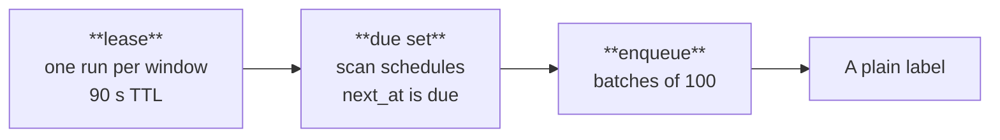
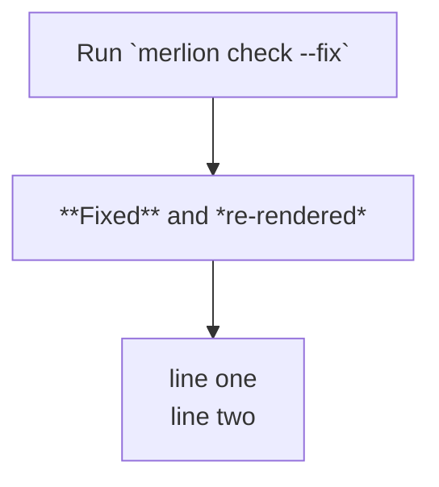
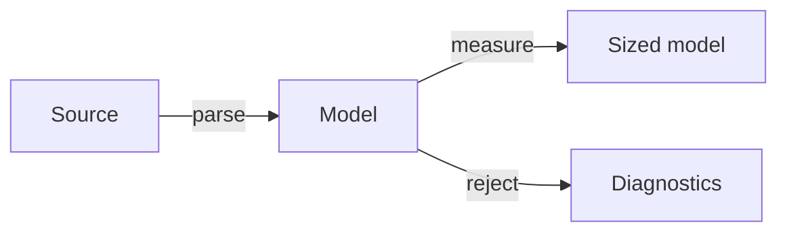

Every label is SVG `<text>`, measured at build time against the font's metrics, so it wraps, selects, copies and reaches search engines and screen readers as text.

## Title + detail labels

A node label whose first line is one `**bold**` span, followed by at least one more line, renders in two tiers: a SemiBold title at the font size, and detail lines at 0.8× the size (11.2 px at 14 px) in the muted colour.



- The title is the first line up to the first `<br>`; surrounding spaces don't count.
- Every later line is a detail line, including wrapped continuations. Detail lines wrap at the same width and keep their own Markdown.
- Detail lines take `--merlion-node-detail` (default: the muted role), which a theme or page overrides. A source `color` from `classDef` or `style` colours the title only.
- Edge labels and cluster titles never split into tiers.

## Markdown and line breaks

| Source | Drawn as |
|---|---|
| `**bold**` | SemiBold, measured with the SemiBold table |
| `*italic*` | Italic |
| `` `code` `` | `ui-monospace` stack, measured at 0.6 em per glyph |
| `<br>`, `<br/>` | Line break |
| Any other HTML | Literal text |



Long labels wrap at the node's maximum width; container fit narrows that width in 20 px steps when a diagram is too wide ([container fit](/how-it-works/layout/container-fit/)). A label over 4,096 bytes is truncated with `W012`. Bidirectional control characters are stripped with `W014`; right-to-left scripts still render in order through the Unicode bidirectional algorithm.

## Edge labels

`a -->|label| b` and `a -- label --> b` put the label on an opaque chip (`--merlion-edge-label-bg`) at the midpoint of the edge's longest segment. The chip moves along the edge until it overlaps no node, cluster title, other label or arrowhead, and the layout reserves room for it, so labels never sit on top of each other.



## Accessible title and description

Every SVG carries `role="img"`, a `<title>` and a `<desc>`, both referenced by `aria-labelledby`:

| Element | Content |
|---|---|
| `<title>` | `accTitle`, else the front-matter `title`, else "Flowchart diagram" |
| `<desc>` | `accDescr`, else a generated outline of the graph |
| `<figcaption>` (rehype, Astro) | `accTitle`, else the front-matter `title`; omitted without either |

```text
flowchart LR
  accTitle: Build pipeline
  accDescr: Markdown files with a mermaid fence render to SVG and are cached.
  src[Source .md] --> has{Has mermaid?}
```

The generated outline lists clusters as headings and edges grouped by source node, with edge labels in brackets:

```text
Flowchart, left to right. 5 nodes, 5 edges.
Build: Source .md → Has mermaid?
Has mermaid? → Render SVG [yes]; → Pass through [no]
Render SVG → Cache
```

`merlion outline` prints it, `--outline <file>` writes it beside a render, the WASM result carries it as `outline`, and the rehype plugin's `outline` hook receives it per diagram. `accDescr` replaces the outline in `<desc>` but not in these plain-text returns, which sites put in `.md` mirrors and `llms-full.txt`.
