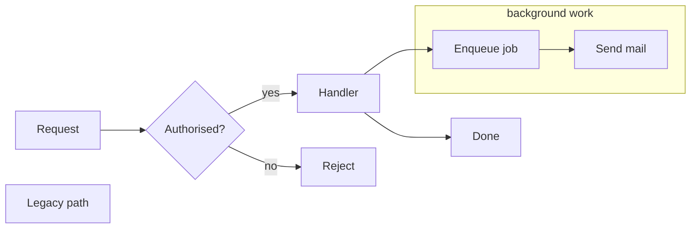
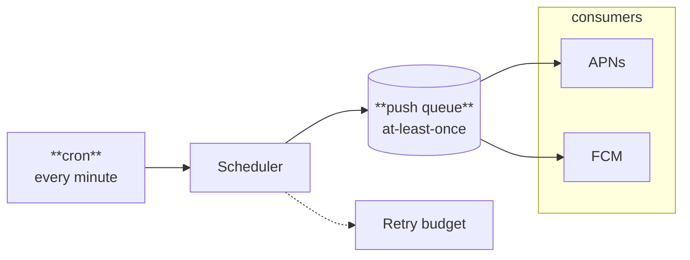

A role is a class name given with `class` or `:::`, with or without a `classDef`. Nodes and edges carry it as `merlion-c-{name}`, clusters as `merlion-cc-{name}`. An edge takes a role through its id: `a e1@--> b`, then `class e1 failure`. A role says what an element is; the theme and the stylesheet decide how it looks, in every theme at once.



## Built-in roles

Eight roles are styled with no stylesheet. `merlion-themes.css` defines their tones in every theme, and each reads a theme token, so setting `--merlion-danger` on a theme retunes every `danger` node and `failure` edge.

| Role | Applies to | Tone | Dash |
|---|---|---|---|
| `accent` | Nodes | `--merlion-accent` | — |
| `ok` | Nodes | `--merlion-ok` | — |
| `warn` | Nodes | `--merlion-warn` | — |
| `danger` | Nodes | `--merlion-danger` | — |
| `muted` | Nodes | `--merlion-muted` | — |
| `group` | Clusters | — | `6 4` on the box |
| `failure` | Edges | `--merlion-danger` | `6 4` |
| `async` | Edges | — | `6 4` |

A tone tints a node's fill (14%), colours its border and mixes into its label (75%); on an edge it colours the path, the arrowhead and the label; on a cluster it tints the box (8%) and colours its border and title. Each edge role gets its own arrowhead marker, so a `failure` arrow is red too. A tone on a cluster never reaches its member nodes.

Role names follow the `classDef` grammar `[A-Za-z_][A-Za-z0-9_-]{0,63}`; any other name is dropped with `W011`. Roles are presentation only: any diagram can put any role on any element.

## Stylesheets

A stylesheet is a CSS subset that sets `--merlion-*` tokens and nothing else. It gives custom roles their tones, retunes the built-in ones and defines themes:

```css
:root { --brand: #0f766e; --merlion-accent: var(--brand); }
[data-theme="dark"] { --merlion-bg: #101418; --merlion-fg: #e6e6e6; }
.merlion-c-store { --merlion-tone: #b8408f; }
.merlion-cc-zone { --merlion-dash: 4 2; }
```

This site's stylesheet (`docs/src/styles/diagrams.css`) maps the foundations and the accent to Starlight's colours and defines the roles every diagram on the site uses beside the built-in ones: `input` (plum) for where a diagram's source enters, `store` (teal) for hints, caches and other kept state, `output` (green) for what a step produces, `style` (amber) for stylesheets and theme inputs, and `optional` for a dashed step that runs only while fuel lasts. The gallery's roles fixture adds `queue` (a plum node) and `senders` (a teal, dashed cluster). Each role carries a light and a dark value:



### What the subset accepts

| Selector | Meaning |
|---|---|
| `:root` | Base theme |
| `[data-theme="<t>"]` | Named theme `<t>` (`[a-z][a-z0-9-]{0,31}`) |
| `:root:not([data-theme])` inside `@media (prefers-color-scheme: dark)` | Automatic dark theme |
| `.merlion-c-<name>`, `.merlion-cc-<name>` | Node and edge role, cluster role |
| `[data-theme="<t>"] .merlion-c-<name>`, `… .merlion-cc-<name>` | Role under a named theme |

- **Theme selectors** set colour tokens, `--merlion-c-<name>-fill` / `-stroke` / `-color` (re-themes a `classDef`), `--merlion-stroke` and private `--<ident>` colours usable through `var()`.
- **Role selectors** set `--merlion-tone` and `--merlion-dash` only.
- **Values** are colour literals (hex, `rgb()`, `hsl()`, named colours, `oklab()` and `oklch()` inside sRGB) or `var(--name[, literal])` naming a token of the same file, resolved at compile time up to 8 deep. A reference resolves in the theme of its rule.
- **Rejected**, with the rule or declaration dropped: fonts, every other property, `color-mix()`, `calc()`, `url()`, `!important`, strings and escapes (`W018`); undefined names and cycles (`W019`); other selectors and at-rules (`W017`).
- **Limits**: 64 KiB, 512 rules, 32 declarations per rule, 16 themes, 256 role selectors, 64 KiB of output; over any of them, `E013`.

The full grammar is in [svg-output.md](/reference/specs/svg-output/#stylesheet); the reasoning is in [ADR-0009](/reference/specs/adr/0009-stylesheet/).

## Pages link compiled CSS only

A page never links the source stylesheet. `merlion css` parses it into a typed model and writes page CSS with literal values under fixed selector shapes; nothing from the source passes through as text. Compiling compiled output yields the same bytes.

```sh
target/release/merlion css site.css -o site.compiled.css  # page CSS: literal values, fixed selector shapes
```

Link it after `merlion-themes.css`, so its rules win at equal specificity. Inline SVGs render without the stylesheet and follow the page's cascade, so theme switching still never re-renders. `--strict` turns `W017`–`W019` into errors; an error writes nothing. `E013` exits `3`.

With a static-site integration the build compiles it once:

```js
// astro.config.mjs
integrations: [merlion({ stylesheet: "src/styles/diagrams.css" })];

// unified pipeline
.use(rehypeMerlion, { stylesheet: "diagram.css" })
```

The Astro integration writes the compiled CSS as an asset imported after `merlion-themes.css` on every page; a refused path, `E013` or a failed compile fails the build, and warnings are logged. The rehype plugin exposes it as `file.data.merlion.css` for the page template to link. Both read the file inside the project root, never through a symbolic link, and refuse anything over 64 KiB before reading it.

## Standalone SVG

An SVG outside a page (a file, an ``, a GitHub embed, librsvg) sees no page CSS. `--css` bakes one theme's values into its presentation attributes and fallbacks, so every renderer draws them:

```sh
target/release/merlion render d.mmd --css site.css --theme dark -o d.svg  # bake one theme into a standalone SVG
target/release/merlion render d.mmd --css site.css --auto-dark dark -o d.svg  # :root, plus dark under prefers-color-scheme
```

`--theme` resolves a `[data-theme]` block over `:root`; the default is `:root` alone. `--auto-dark` adds the named block as a `prefers-color-scheme: dark` variant, which an `` embed follows. A name the stylesheet does not define exits `2`. A baked SVG never declares a custom property, so a page that inlines it can still theme it. Through WASM, pass `compileStylesheet(css, { theme }).palette` as the `palette` render option.

## Precedence

Per property and per element, highest first:

1. Node `style` and edge `linkStyle` literals.
2. `classDef` colours, through their `--merlion-c-{name}-*` tokens.
3. Stylesheet role rules, by specificity, then source order.
4. Built-in roles.
5. The theme, then the built-in default.

A `classDef` colour reads `var(--merlion-c-{name}-fill, <literal>)`: unthemed renders, mermaid and GitHub show the author's literal, and a stylesheet that sets the token re-themes it. `I030` flags a source colour that ignores the theme; `I033` flags a source literal that masks a stylesheet tone on the same element.
