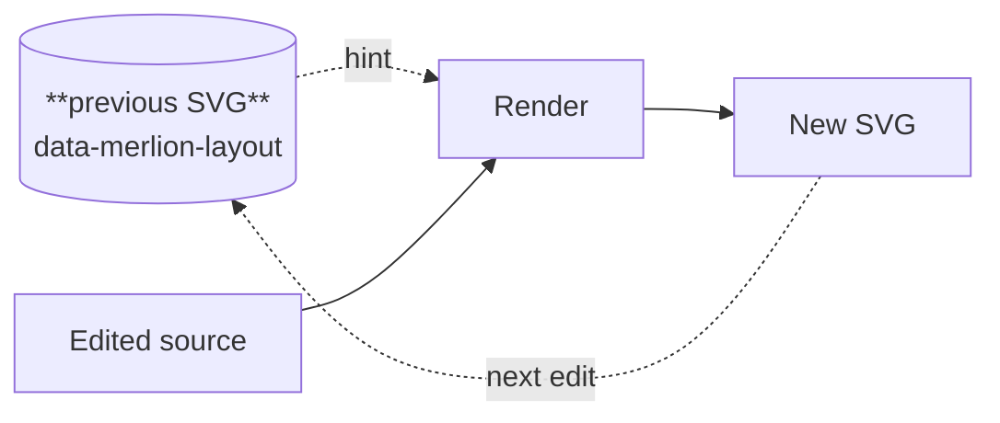

Every Merlion SVG records its layout in `data-merlion-layout`: the node order of each layer, keyed by source id. Given that SVG back as a hint, the next render keeps surviving nodes in their order, each within `stability` (default 2) positions of where it was, and places new nodes where they add the fewest crossings. An edit then moves the part of the drawing it touched, not the whole diagram.



The hint carries order only, never coordinates, so it survives changes to fonts, spacing and container width. Try it in the [playground](/playground/): each keystroke renders with the previous SVG as the hint, and **Fresh layout** drops it.

## Where the hint comes from

| Surface | Hint |
|---|---|
| CLI | The existing output file, automatically. `--hint <previous.svg>` names another; `--no-hint` forces a fresh layout |
| rehype plugin, Astro | `cacheDir: ".merlion"` stores the last SVG of each (file, block) and passes it on the next build |
| WASM | `render(source, { hint: previousSvg })` |
| Core (Rust) | `RenderOptions.hint` |

```sh
target/release/merlion render diagram.mmd -o diagram.svg              # reuses diagram.svg as the hint
target/release/merlion render diagram.mmd -o diagram.svg --no-hint    # fresh layout
target/release/merlion render diagram.mmd --hint old.svg -o new.svg   # an explicit hint
```

```js
let previous = null;
const update = (source) => {
  const { svg } = render(source, { idPrefix: "live", ...(previous ? { hint: previous } : {}) });
  if (svg) previous = svg;
  return svg;
};
```

The rehype cache is keyed by file path and block index. Every build renders every block; a cached SVG is only ever a hint, never inlined, because anyone who can write the cache directory controls its bytes. Inserting a diagram above others shifts the indices, and the hint that lands on the wrong diagram is discarded for having too few surviving nodes.

## What survives

A node survives when it is in both the hint and the new source and its layer is unchanged. A node whose layer moves (because an edit changed what it depends on) counts as new.

| Outcome | Diagnostic |
|---|---|
| Every node survives | None. Re-rendering unchanged source with its own SVG as the hint is byte-identical |
| Some nodes are new | `I021 LayoutHintPartial`, with the count |
| Fewer than half survive | `I020 LayoutHintDiscarded`; the render is a fresh layout |
| Hint malformed, of an unknown version, or over 1 MiB | `I022 LayoutHintInvalid`; the render is a fresh layout |

All three are `Info`: a bad hint never fails a render. With `direction: "auto"`, the hint's direction is kept while it still fits the container width.

Across the mermaid compat corpus, surviving nodes move 0.054 of the drawing's size on average after a one-line edit (p95 0.253), against 0.059 / 0.311 for mermaid with dagre and 0.060 / 0.258 with ELK (`bench/results/2026-09-22-round2.md`). The algorithm is on [How it works: stable layout](/how-it-works/layout/stable-layout/); the contract is in [layout.md](/reference/specs/layout/#stable-layout).
