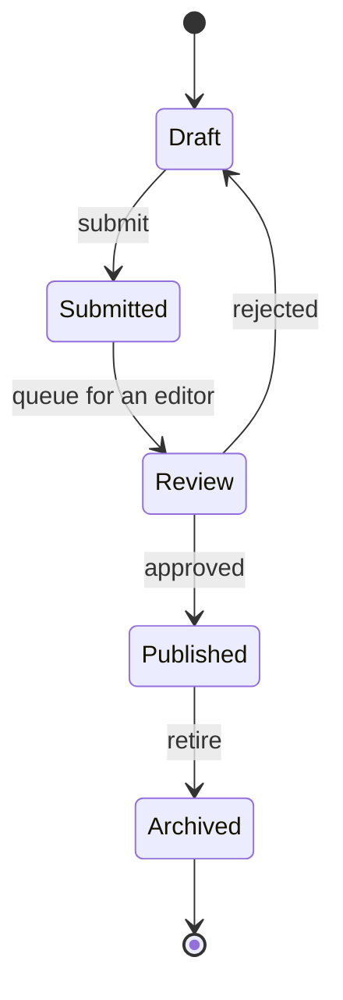
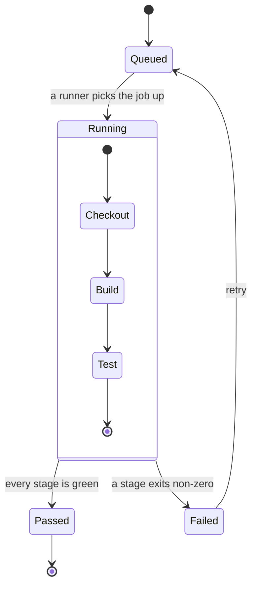
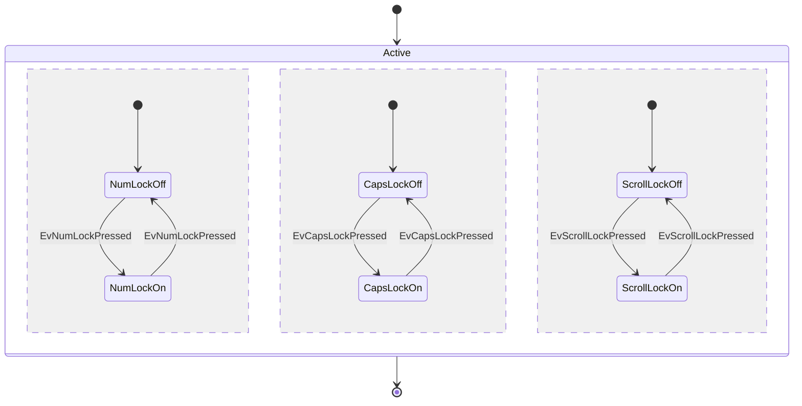
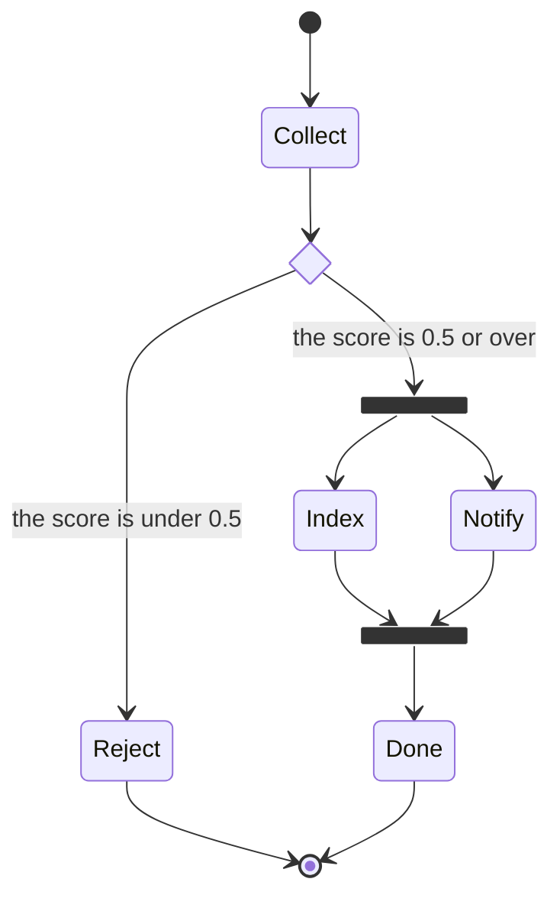
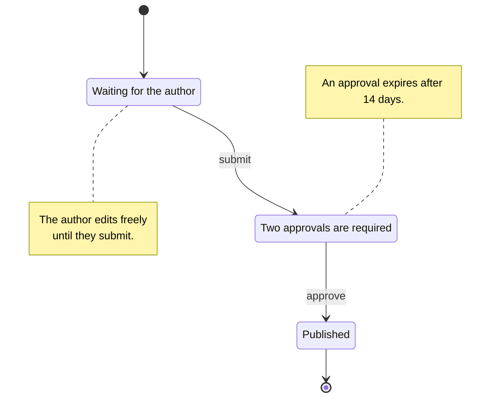
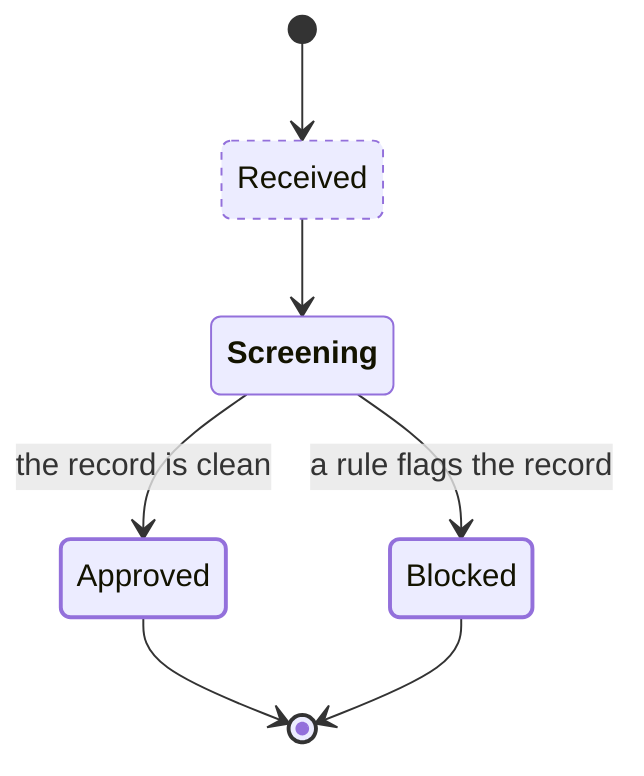

`stateDiagram` and `stateDiagram-v2` both draw a state machine. They parse to the same model and produce the same SVG: mermaid keeps two renderers and points the older header at the older one, but the difference there is appearance, and Merlion has one appearance.



A state machine is graph-shaped, so it lowers onto the same layered engine a flowchart runs on and gets layering, crossing minimisation, orthogonal routing, container fit and stable layout without a layout module of its own ([How the lowering works](/how-it-works/state-lowering/)).

## States and transitions

`-->` is the only arrow the grammar defines. A bare id declares a state whose label is the id; a state named by a transition before any declaration is declared at that point.

```
Still
state "This is a state description" as s2
s3 : A description written after the fact
s1 --> s2 : A transition label
```

Every form that describes a state adds to the same description list: the first replaces the id the state draws, each later one adds a line.

## Start and end

`[*]` is the start state as a transition's source and the end state as its target. Every `[*]` in one scope names the same pair, so a machine has one start disc and one end ring — and so does each composite state, in its own scope.

## Composite states

`state <id> { … }` nests a whole machine inside a state. Nesting goes 64 deep; deeper input is `E010`.



mermaid refuses a transition between members of two different composite states. Merlion draws it: the layout routes the edge across the cluster boundary through a port on it, so the graph the source describes is the graph the reader sees.

## Concurrency

`--` inside a composite state splits its body into regions that run at the same time. Each region resolves its own `[*]`, and a dashed divider marks every boundary after the first.



## Choice, fork and join

`<<choice>>`, `<<fork>>` and `<<join>>` set a state's kind; `[[choice]]` and friends are mermaid's alternate spelling of the same markers. A choice draws as a diamond, a fork and a join as bars, and none of the three draws a label — the transitions leaving them carry the meaning.



## Notes

`note left of <id>` and `note right of <id>` take `: <text>` on the same line or lines up to `end note`. A note is geometry, not a graph node: the lowering inflates its state's measured extent and places the note inside the space the engine already reserved, so a note box overlaps no node, no cluster title and no routed edge.



## Direction

`direction TB`, `BT`, `LR` and `RL` set the diagram's direction. Written inside a composite state the keyword is recorded on the state and the diagram's direction still decides the drawing, exactly as for a flowchart subgraph.

## Diagnostics

Codes shared with flowcharts keep their meaning ([Diagnostics](/guides/diagnostics/)). These are the state grammar's own:

| Code | Severity | Meaning |
|---|---|---|
| `W024` | Warning | `hide empty description`, `scale … width`, a floating note, a `click` tooltip or text after a state id, dropped |
| `W025` | Warning | `<<…>>` naming something other than `choice`, `fork` or `join`; the state stays plain |
| `R014` | Repair | `state <id> {` with no `}`; closed at end of input |
| `R015` | Repair | `}` with no open composite state; dropped |
| `R016` | Repair | `--` outside a composite state; dropped |
| `R017` | Repair | A transition with text and no `:`; the `:` is inserted |
| `R018` | Repair | An arrow other than `-->`; read as `-->` |

Every repair carries a fix, so `merlion check <file> --fix` edits the source into one that parses without the repair. A machine written with flowchart and sequence habits still draws:

```mermaid
stateDiagram-v2
    accTitle: A source written with the wrong arrows, drawn through the repairs
    [*] -> Idle
    Idle ->> Fetching : refresh
    Fetching --> Ready
    Ready ==> Idle : reset
    Ready -.-> Failed : the request times out
    Failed --> [*]
```

```
$ merlion check llm-wrong-arrows.mmd
llm-wrong-arrows.mmd:2:9: repair R018 `->` is read as `-->`: the grammar defines one arrow
llm-wrong-arrows.mmd:3:10: repair R018 `->>` is read as `-->`: the grammar defines one arrow
llm-wrong-arrows.mmd:5:11: repair R018 `==>` is read as `-->`: the grammar defines one arrow
llm-wrong-arrows.mmd:6:11: repair R018 `-.->` is read as `-->`: the grammar defines one arrow
```

A transition to an undeclared state is not repaired: naming a state in a transition is how the grammar declares it, so there is nothing to fix.

## Theming

State diagrams add one pair of tokens, `--merlion-note-bg` and `--merlion-note-border`, so a note reads as an annotation rather than as another state. Every other mark reuses a token a flowchart already defines, so every palette, every theme and every compiled stylesheet colours a state machine without a change ([Theming](/guides/theming/)).

| Mark | Token |
|---|---|
| State box, choice diamond | `--merlion-node-bg`, `--merlion-node-border`, `--merlion-node-text` |
| Start and end discs, fork and join bars | `--merlion-fg` fill, `--merlion-node-border` stroke |
| Transition and its arrowhead | `--merlion-edge` |
| Transition label | `--merlion-fg` over `--merlion-edge-label-bg` |
| Note box, note connector | `--merlion-note-bg` and `--merlion-note-border` (bg / warn), `--merlion-line` dashed |
| Composite box and title, region divider | `--merlion-cluster-bg`, `--merlion-cluster-border` |

The marks that draw in ink — start, end, fork and join — take `--merlion-fg` through their element classes rather than through a role, so they stay solid under every theme and no automatic tone tints them.

### Roles and automatic tones

`classDef`, `class` and `:::` work exactly as in flowcharts: a state takes node roles, a composite state cluster roles ([Roles and stylesheets](/guides/roles-and-stylesheets/)). A transition takes none, because the grammar gives a transition no id to name.



The automatic tones need no rule of their own either: applied to the shapes the lowering produces, the flowchart table already gives a choice the `warn` tone and each top-level composite state the next series tint. Nested composites, regions, simple states, notes and transitions stay neutral. `--no-auto-tone` and `autoTone: false` turn the tones off.

## Interaction

Inside `<merlion-view>`, a state machine is interactive under the flowchart's rules, because states are nodes and transitions are edges ([The viewer](/guides/viewer/)). Click any state above.

| Gesture | Effect |
|---|---|
| Tap a state | Lights the state, every transition touching it and the states at their other ends; the popover lists its outgoing and incoming transitions with their labels |
| Tap a transition | Lights it and both its states |
| Tap a composite title | Collapses it: the members disappear, the box turns dashed and takes a `+N` badge. A collapsed composite hides its concurrency dividers too |
| Alt + tap a composite title | Pins what it holds: every state inside it and every transition between two of them |
| Arrow keys | Walk the states in the order the source declares them, each composite ahead of the first state it holds; `Enter` pins the current one |

A state that draws no label is read out as the text alternative names it — `start`, `end`, `score_gate (choice)` — never as the generated id behind it. A note belongs to the state it points at: it never dims, and it disappears with its state when that state is hidden.

Every diagram also carries its machine as text, in the SVG's `<desc>`, which is what a screen reader reads and what the keyboard walk announces line by line. The CI job above reads:

```
State diagram, top to bottom. 11 states, 10 transitions.
start → Queued
Queued → Running [a runner picks the job up]
Running → Passed [every stage is green]; → Failed [a stage exits non-zero]
Running: start → Checkout
Running: Checkout → Build
Running: Build → Test
Running: Test → end
Running: end
Passed → end
Failed → Queued [retry]
```

The outline reads the machine, not the graph it lowers to: a transition naming `Running` prints that name rather than the first member inside it, a generated `[*]` prints as `start` or `end`, and a composite state heads the lines of the states it holds.

It describes what is drawn. A transition between a composite state and a state inside it is not drawn, so the outline neither lists nor counts it, and a closing line says how many the drawing leaves out.

## Limits

| Limit | Value |
|---|---|
| States | 2,000 (`E004`) |
| Transitions | 4,000 (`E004`) |
| Notes | 2,000 (`E004`) |
| Composite nesting | 64 (`E010`) |
| Label bytes | 4,096 |

Every state fixture of the core's test suite renders in the [gallery](/gallery/state-diagrams/), the LLM-style repairs included.
