`<merlion-view>` is a custom element from `@fractalbox/merlion-view` that adds pan, zoom and fullscreen to the SVG inside it. It is optional: without JavaScript, or before the element upgrades, the SVG renders as a normal static diagram. It is independent of the renderer and wraps any inline SVG, mermaid's included.

```html
<script type="module">import "@fractalbox/merlion-view";</script>

<merlion-view>
  <svg class="merlion merlion-flowchart" viewBox="0 0 …">…</svg>
</merlion-view>
```

The rehype plugin wraps every diagram in it (`viewer: false` to skip), and the Astro integration loads the element only on pages that contain one. Every diagram on this site is inside one: hover it for the controls. This one is wider than the column, so it opens fitted, and zooming brings its labels back to full size:

```mermaid width=1600
flowchart LR
  accTitle: Release pipeline
  commit[Commit] --> lint[Lint] --> test[Unit tests] --> build[Build wasm] --> opt[wasm-opt] --> hash[Hash check] --> sign[Sign tag] --> attest[Attest] --> npm[Publish npm] --> crates[Publish crates] --> announce[Announce]
  class commit input
  class build,sign accent
  class hash warn
  class npm,crates,announce output
```



## Input

| Input | Action |
|---|---|
| Ctrl/⌘ + wheel, trackpad pinch, touch pinch | Zoom around the pointer, 0.25× to 8× |
| Plain wheel | Scrolls the page; the diagram doesn't capture it |
| Drag, or one-finger drag when zoomed in | Pan |
| Double-click, double-tap | Reset to fit |
| `+` / `-` / `0` / arrow keys, when focused | Zoom in, zoom out, reset, pan by 10% |
| Fullscreen button | Moves the SVG into a modal `<dialog>` sized to the viewport; `Esc` closes it |

- Zoom is a CSS `transform` on the SVG element: text stays vector-sharp and nothing re-renders.
- The controls (zoom in, zoom out, reset, fullscreen) are `<button>`s with `aria-label`s. They show on hover or focus, and always on touch devices.
- Controls appear only when the SVG's natural width exceeds its container; `controls="always"` shows them regardless.
- The element is focusable and takes the SVG's `<title>` as its accessible name.
- Fullscreen moves the SVG, never clones it, so its ids stay unique on the page, and moves it back when the dialog closes.
- With `prefers-reduced-motion`, zoom and reset jump instead of animating.
- The element fills the height its container gives it and centres the SVG; the controls sit in its top-right corner.

## Semantic zoom

When the reader zooms out past the fit view and labels would draw below 9 px on screen, the viewer adds the class `merlion-zoomed-out` to itself and sets `data-merlion-rank-limit="{0..15}"`. Rules in `merlion-themes.css` then hide the labels of nodes whose `data-merlion-rank` exceeds the limit. For flowcharts the rank is dominator depth, so entry points and the nodes that control the flow keep their labels longest.

- Only labels hide. Node shapes, edges and cluster members stay drawn at every zoom level.
- The fit view and every zoom-in keep every label, even when a wide diagram fitted to its container draws them small, so a diagram never loses content before the reader touches it.
- The viewer toggles one class and one attribute on itself. It never modifies the SVG and never makes a request.

## Constraints

| Budget | Limit |
|---|---|
| `@fractalbox/merlion-view`, minified and gzipped | ≤ 6 KB, checked in CI (`pnpm size`) |
| `merlion-themes.css` with the 120 semantic-zoom selectors, gzipped | ≤ 8 KB |
| Runtime dependencies | 0 |

It runs in every browser with custom elements, pointer events and `<dialog>`. The contract is in [viewer.md](/reference/specs/viewer/).
