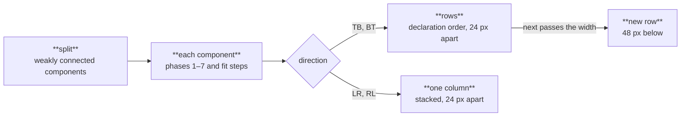
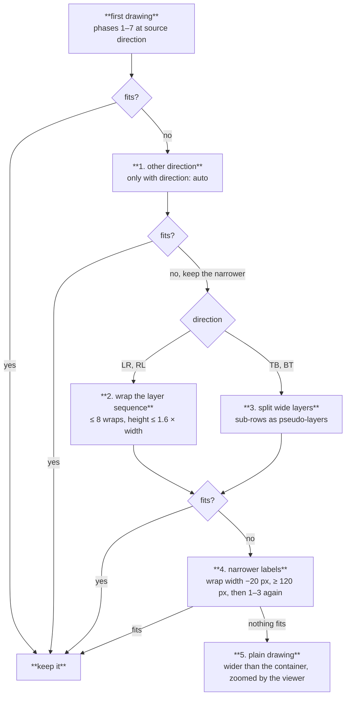

Layout takes the container width, `width` (720 px by default), as an input. After phases 1–7 produce a first drawing, container fit tries a fixed sequence of alternatives and keeps the first one that fits. When none fits, it keeps the plain drawing and leaves the rest to [`<merlion-view>`](/guides/viewer/). Code: `crates/merlion-render/src/layout/pipeline.rs` (`run_one`, `fit_steps`, `reduce_wrap`), `fit.rs` and `pack.rs`.

## Disconnected components

A diagram with more than one weakly connected component is laid out one component at a time, and the drawings are packed. A cluster joins the component of its nodes, so a cluster whose nodes lie in several components merges them; a cluster with no node keeps the whole diagram in one layered graph.

Components are packed in declaration order (by each component's first node), aligned on their layer-0 side, `node_spacing` apart and `rank_spacing` between rows. An edit therefore moves only its own component and the components after it in the same row. With `direction: auto`, both directions are packed, and the second replaces the first when it fits or is narrower.

## The steps

1. **Other direction.** With `direction: auto`, lay out in the other direction. Keep it if it fits; otherwise continue with the narrower of the two.
2. **Wrap (`LR`/`RL`).** Layers are columns, so width grows with the number of layers. Split the sequence at the boundary with the fewest crossing edges, preferring the middle half of the drawing and ties nearest the midpoint, never inside a cluster, and place the second part below the first. Repeat on the longest part, up to 8 times, while height stays at most `max_aspect` (1.6) × width. Edges that cross a wrap route around the outside and carry `data-merlion-wrap="true"`. Only a wrap that reaches the width is kept.
3. **Split (`TB`/`BT`).** Layers are rows, so width grows with the widest layer. Split each layer wider than the container into sub-rows of consecutive nodes balanced by width, each cut within a quarter row of its balanced position where it separates the fewest edges; each sub-row becomes a pseudo-layer so edges keep pointing down. Round *i* uses ⌈width / container⌉ + *i* rows, and more rows are tried only while the drawing gets narrower and stays within `max_aspect`.
4. **Narrower labels.** Reduce the label wrap width (200 px by default) in 20 px steps, down to 120 px, skipping widths no label reaches, re-measure only the labels that change, and run steps 1–3 again.
5. **Give up cleanly.** When nothing fits, no wrap, split or narrower label is kept. A partial wrap or split that is still too wide routes edges around every wrap and turns layers into staircases, which costs more crossings, bends and edge length than zooming the whole drawing. The viewer shows its zoom controls whenever the drawing is wider than its container.

## Cost

Every alternative is a full layout, so fit draws fuel like any other pass. It attempts another candidate only while the fuel left covers one more drawing the size of the first; a candidate that runs out of fuel is dropped and ends the search, and the best drawing so far stands ([Render pipeline](/how-it-works/render-pipeline/#fuel)).

The hint is recorded before fit runs: its layers are phase 2's, before split rows and wraps, so a change in fit never changes the hint ([Stable layout](/how-it-works/layout/stable-layout/)).

Aspect ratio is a soft constraint, following ARCOL (Alsuwaykit et al., 2026). The full rules: [specs/layout.md §5](/reference/specs/layout/#5-container-fit).
