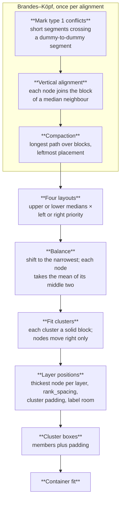

Phase 4 keeps the order from [crossing minimisation](/how-it-works/layout/crossing-minimisation/) and decides where each node sits. It works in a direction-free frame: the order coordinate runs along a layer and the layer coordinate across layers, which are x and y for `TB`; `LR`, `BT` and `RL` transpose or mirror the result. The aim is short, straight edges without breaking the minimum gap between neighbours.

Specification: [layout.md §4](/reference/specs/layout/#4-coordinate-assignment). Code: `crates/merlion-render/src/layout/coords.rs`.

## Brandes–Köpf

Brandes and Köpf (GD 2001) place nodes in linear time with few bends:

1. **Conflicts.** A segment between two dummy nodes is part of a long edge. Any other segment that crosses it is marked, so alignment never bends a long edge to straighten a short one.
2. **Alignment.** Layer by layer, each node tries to join the block of its median upper neighbour (with an even count, the two middle ones in turn). A node joins only when the segment is unmarked and lies to the right of the previous alignment in the layer, so blocks never cross. Each block becomes one vertical line.
3. **Compaction.** Blocks are placed by a longest-path pass over the block constraint graph: two neighbours in a layer must be at least their half-widths plus `node_spacing` (24 px by default) apart, half that next to a dummy, because edges pack tighter than boxes. This gives the leftmost placement that keeps every separation.

The three steps run four times: aligning with upper or with lower neighbours, and with left or with right priority (the right-priority runs work on the mirrored layers and are negated back). Each layout favours a different side. Balancing shifts all four onto the narrowest one, left-priority layouts by their left edge and right-priority layouts by their right edge, then gives each node the average of its two middle candidates. Every one of the four layouts keeps the separation, and the balanced one does too: for neighbours `u` left of `v`, each candidate of `v` exceeds the matching candidate of `u` by the separation, so the second and third smallest do as well. Finally the drawing shifts so its leftmost edge is at 0.

## Clusters

Brandes–Köpf knows nothing of subgraphs, so a second pass turns every cluster into a solid block. Each cluster gets one left and one right boundary shared by all the layers it spans; members stay inside with padding and non-members stay outside. The constraint graph is acyclic because sibling clusters keep one order in every layer, and a longest-path solve moves nodes right of their Brandes–Köpf position only as far as the constraints require. A vertical run of one-to-one segments moves as one piece, so a chain drawn straight stays straight, unless tying it would make the drawing wider.

## Layers

Across layers, each layer is as thick as its thickest node. Neighbouring layers sit `rank_spacing` (48 px by default) apart, more where nested cluster boxes open or close between them (their padding and titles stack, plus 8 px), and more where edge labels between neighbouring layers need the gap: a labelled edge reserves its chip plus room for its end markers, and labels whose chips would collide stack across the gap. Cluster boxes then enclose their members and nested boxes with padding.

Every step burns fuel and is mandatory; exhaustion returns `TooLarge`. The next phase is [container fit](/how-it-works/layout/container-fit/), which checks the drawing against the container width.
