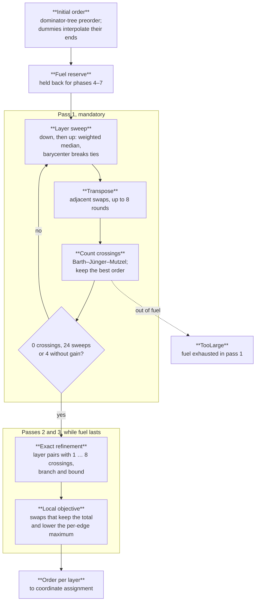

Phase 3 decides the left-to-right order of the nodes in every layer, and with it how many edges cross. Minimising crossings between layers is NP-hard even for two layers, so Merlion runs one mandatory heuristic pass and two optional passes that improve its result while fuel lasts. Every pass keeps two constraints: each cluster occupies one contiguous span of every layer, with sibling clusters in the same order in all layers, and under a [layout hint](/how-it-works/layout/stable-layout/) surviving nodes keep their hinted order.

Specification: [layout.md §3](/reference/specs/layout/#3-crossing-minimisation). Code: `crates/merlion-render/src/layout/order.rs`.

## Initial order

Each layer starts sorted by the depth-first preorder of the dominator tree from [cycle removal](/how-it-works/layout/cycle-removal/), so the region a node dominates starts out contiguous. A dummy node takes a key interpolated between the keys of its edge's two ends, and a cluster filler takes the smallest key in its cluster. Layers are arranged hierarchically: a cluster's own nodes are sorted by key and merged with its child clusters, which keep one global order.

## Pass 1: layer sweeps

Sweeps alternate direction. A downward sweep orders each layer by the positions of its neighbours in the layer above, an upward sweep by the layer below. The sort key is the weighted median of those positions (Gansner et al., 1993), with the barycenter as the tie-breaker and the current position after that. After each sweep, greedy transposition swaps adjacent nodes whenever the swap lowers crossings, for up to 8 rounds or until a round changes nothing. Crossings are then counted with the accumulator tree of Barth, Jünger and Mutzel, and the best order so far is kept. The pass stops at zero crossings, after 24 sweeps, or after 4 sweeps without improvement, and restores the best order it saw.

Pass 1 is mandatory. Before it starts, the pipeline reserves enough fuel for the coordinate, routing and cluster phases that follow; running out of fuel inside pass 1 ends the render with `TooLarge`.

## Pass 2: exact refinement

For each pair of neighbouring layers with between 1 and `k = 8` crossings, and for each of the two layers in turn with the other fixed, Merlion solves one-sided crossing minimisation exactly. It splits the free layer into runs of neighbouring nodes that share a cluster, and for each run of 2 to 12 nodes builds the pairwise crossing matrix and finds the best permutation by branch and bound, with `Σ min(c[a][b], c[b][a])` over the unplaced pairs as the lower bound. The new order is kept only if it lowers the crossings around that layer and respects the stability limit.

One-sided crossing minimisation is fixed-parameter tractable in the number of crossings (Dujmović and Whitesides, 2004), so the search stays small at `k ≤ 8`. Merlion never solves more than two layers jointly: exact multi-layer minimisation has no subexponential algorithm for five or more layers unless the Exponential Time Hypothesis fails (Fomin et al., SODA 2026).

## Pass 3: local objective

The total can hide one edge crossed many times. Pass 3 visits adjacent pairs whose swap leaves the pair's crossings unchanged and swaps them when that lowers the largest number of crossings on any single edge between the layer and its neighbours.

## Fuel

Passes 2 and 3 draw optional fuel: they may not touch the reserve, and when their budget runs out they stop and keep every improvement made so far. Two renders of the same input therefore stop at the same step on every machine, because fuel counts work units, not time ([ADR-0008](/reference/specs/adr/0008-deterministic-work-budget/)).

The next phase is [coordinate assignment](/how-it-works/layout/coordinate-assignment/).
