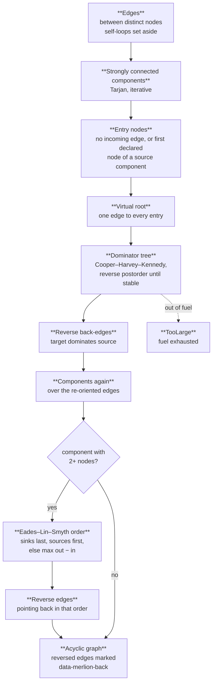
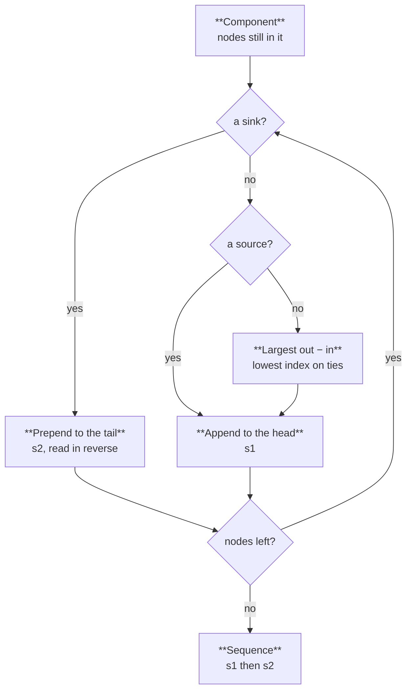
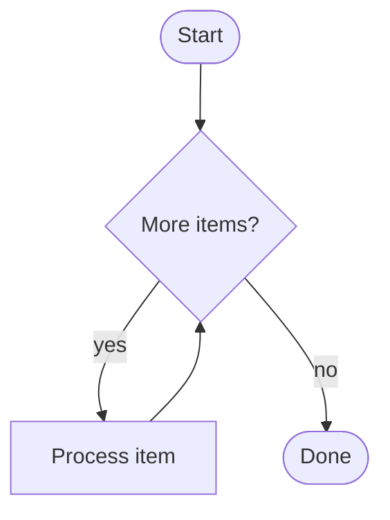

A layered drawing needs every edge to point down, so phase 1 picks the edges to reverse. Flowcharts are control flow: a loop has a header that every path into the loop passes through. Merlion finds those headers with a dominator tree and reverses only the edges that jump back to one, so a loop reads top to bottom from its header and its closing edge is the one drawn going up. Cycles that have no header (a jump into the middle of a loop) fall through to a greedy feedback-arc-set heuristic.

Specification: [layout.md §1](/reference/specs/layout/#1-cycle-removal). Code: `crates/merlion-render/src/layout/acyclic.rs`.

## Steps

1. **Entries.** A node with no incoming edge is an entry. So is the first declared node of every strongly connected component that no edge enters from outside, which gives a graph that is one big cycle a place to start. A virtual root gets an edge to each entry, so every node is reachable from one place.
2. **Dominators.** Node `d` dominates `v` when every path from the root to `v` passes through `d`. The tree comes from the iterative algorithm of Cooper, Harvey and Kennedy: walk the nodes in reverse postorder and intersect the dominators of each node's processed predecessors until nothing changes.
3. **Back-edges.** An edge `u → v` whose target `v` dominates its source `u` closes a loop, and is reversed.
4. **Irreducible cycles.** A cycle entered at two places has no dominating header, so step 3 leaves it intact. The components are computed again over the re-oriented edges; each one that still holds a cycle is ordered by the Eades–Lin–Smyth greedy heuristic, and every edge pointing backwards in that order is reversed.

Reversed edges keep their original direction in the drawing: the arrow still points where the source says, and the edge group carries `data-merlion-back="true"`.

The dominator tree does more than pick back-edges. Its depth, clamped to 15, becomes each node's `data-merlion-rank`, which drives [semantic zoom](/guides/viewer/). Its depth-first preorder, children in declaration order, is the initial order of every layer in [crossing minimisation](/how-it-works/layout/crossing-minimisation/), so a node's dominated region starts out contiguous.

## Eades–Lin–Smyth

The heuristic builds a sequence from both ends. It repeatedly moves every sink to the back and every source to the front; when neither is left, it moves the node with the largest out-degree minus in-degree to the front, the lowest index on ties. Edges that point from later to earlier in the final sequence form the feedback arc set.

## Example

The loop below has one header, `check`. It dominates `work`, so `work → check` is the back-edge, drawn going up while `check` and `work` keep top-to-bottom order.

## Bounds

Every step is iterative, with no recursion, and burns one fuel unit per node or edge step ([ADR-0008](/reference/specs/adr/0008-deterministic-work-budget/)). Phase 1 is mandatory: running out of fuel here ends the render with `TooLarge`, never a partial layout. The next phase is [layer assignment](/how-it-works/layout/layer-assignment/).
