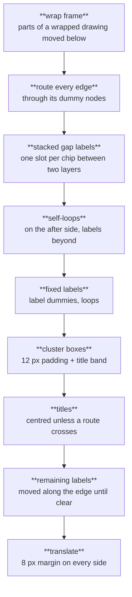
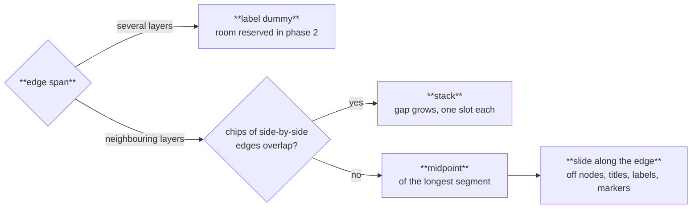
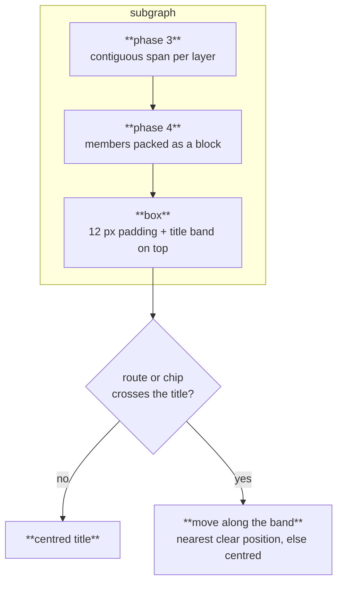

Phases 6 and 7 turn the ordered, positioned layered graph into drawable geometry: a path per edge, a chip per edge label, and a box with a title per subgraph. Routing works in the layout frame (`TB`, layers top to bottom); `route::to_final` then rotates or mirrors the points for `BT`, `LR` and `RL`. Code: `crates/merlion-render/src/layout/route.rs` and `finish` in `pipeline.rs`.

## Order of work

The two dashed steps search for a position and draw optional fuel; when it runs out, a title stays centred and a label stays at its first position.

## Edge styles

| `edgeStyle` | Path |
|---|---|
| `orthogonal` (default) | Vertical runs through the dummy nodes' positions and horizontal jogs in the gaps between layers. The draw stage rounds interior corners with a 6 px radius |
| `polyline` | Straight segments through the dummy nodes' centres, meeting each node outline on the line towards its neighbour |
| `spline` | Routed and drawn exactly as `polyline` until sleeve routing ships ([roadmap](/reference/specs/roadmap/)); smoothing the polyline alone would overshoot its corners and leave the viewBox |

In `orthogonal`, several edges leaving one node side get **ports** spread evenly along that side, ordered by where each edge's other end lies, so they fan out without crossing at the node. Jogs that share a gap get distinct heights spread evenly across it, in the order that makes the fewest legs cross another jog, and they stay clear of cluster boxes that end or start at that gap, whose padding and title bands lie there. Reversed edges from [cycle removal](/how-it-works/layout/cycle-removal/) are drawn in their original direction and marked `data-merlion-back="true"`.

## Edge labels

Every label sits on an opaque chip (`--merlion-edge-label-bg`). Placement and reserved space use the chip's outer size, padding included, plus 4 px clearance.

- An edge spanning several layers gets a label dummy in the layered graph, so phase 4 reserves the label's room like a node's.
- Between neighbouring layers there is no dummy, so the gap between the layers grows to hold the chip and the arrow markers at both ends. When several such chips, centred between their edges' ends, would overlap, they **stack**: the gap grows to hold every chip of the group plus the markers, and each chip takes an equal slot of the part of the gap the markers leave free, on its own edge.
- Every other label starts at the midpoint of the edge's longest segment and moves along the edge until it overlaps no node, no cluster title, no other label and neither end marker (the last 10 px of the path).

## Clusters

Subgraphs are laid out as compound nodes from phase 3 on: every cluster occupies a contiguous span of each layer it touches, and sibling clusters keep one order across all layers, so phase 4 can treat each cluster box as a solid block.

- The box encloses its members with 12 px padding; the title band (padding plus title height) sits on the side that is the top of the screen.
- A cluster with no node is drawn as a box around its title; a wrap never cuts through a cluster.
- The title moves along its band, within the padding, to the nearest position that leaves every crossing route room for its label chip, else the nearest position clear of the routes, else it stays centred. Titles then count as obstacles for the labels placed after them.
- `style` and `class` on a subgraph id style the box and title only; member nodes keep their own colours ([Roles and stylesheets](/guides/roles-and-stylesheets/)).

The rules in full: [specs/layout.md §6](/reference/specs/layout/#6-edge-routing) and [§7](/reference/specs/layout/#7-clusters-subgraphs).
