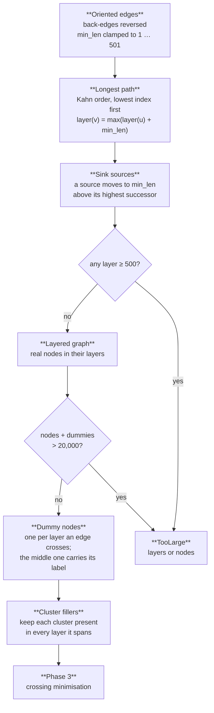
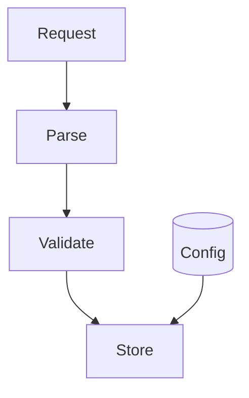

Phase 2 gives every node a layer so that each forward edge `u → v` has `layer(v) ≥ layer(u) + min_len`. It works on the acyclic graph that [cycle removal](/how-it-works/layout/cycle-removal/) leaves, with back-edges turned around. The result reads like code: a node sits below every node that must happen before it, and so below all of its dominators (VEIL; Schaad, Ben-Nun and Hoefler, 2025).

Specification: [layout.md §2](/reference/specs/layout/#2-layer-assignment). Code: `crates/merlion-render/src/layout/layering.rs` for the layers, `crates/merlion-render/src/layout/lgraph.rs` for the layered graph.

## Longest path

Nodes with no predecessor start at layer 0. The rest are taken in topological order (Kahn's algorithm, lowest node index first, so the result is deterministic), and each lands one `min_len` below the lowest of its predecessors. A `min_len` above 1 comes from longer arrows in the source (`--->`) and is clamped to the layer limit plus one.

## Sinking sources

Longest path puts every source at layer 0. A second entry point that feeds a node far down would then sit at the top with a long edge running past everything between. Merlion moves each source that has a successor down to one `min_len` above its highest successor. Only sources move, and a source has no predecessor to stay below, so every edge still points down. An isolated node stays at layer 0.

`Config` has no predecessor. It sinks from layer 0 to layer 2, next to `Validate`, and its edge to `Store` spans one layer instead of three.

## Dummy nodes and limits

An edge spanning `L` layers gets `L − 1` dummy nodes, one per layer it crosses, so every edge in the layered graph joins neighbouring layers. When a labelled edge spans two or more layers, the dummy in the middle layer carries the label's size and reserves room for it. Clusters get filler nodes in the layers they span without a node of their own, plus one that reserves the width of the title in their first layer; a cluster with no nodes gets a single placeholder.

Two limits apply before anything large is allocated ([architecture.md, Boundaries](/reference/specs/architecture/#boundaries)): 500 layers, and 20,000 nodes counting real nodes plus dummies. Without the second, 2,000 nodes and 2,000 long edges could reach four million dummies. Both return `TooLarge`, as does running out of fuel, which Kahn's loop burns one unit per node and per edge.

The next phase is [crossing minimisation](/how-it-works/layout/crossing-minimisation/).
