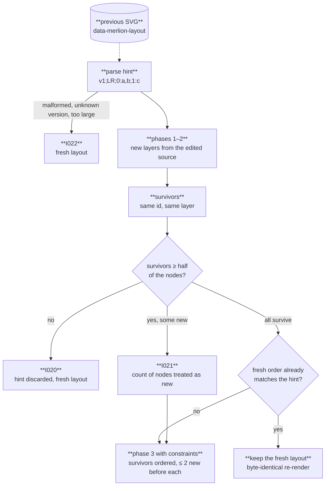

Re-rendering an edited diagram with its previous SVG as the hint keeps the drawing recognisable: nodes that survive the edit keep their order within their layer, and at most `stability` (default 2) new nodes land in front of any of them. The problem is the Constrained Incremental Graph Drawing Problem (Charytitsch and Nascimento, 2026). Code: `crates/merlion-render/src/layout/hint.rs`, `read_hint` and `run_one` in `pipeline.rs`, and the `Stable` constraint in `order.rs`. How to pass a hint from the CLI, rehype and JavaScript: [Stable layout guide](/guides/stable-layout/).

## From hint to order



## Hint

`data-merlion-layout` on the SVG root records the direction and, per layer, the node ids in order:

```
v1;TB;0:a,b;1:c,d,e;2:f
```

Layers are the ones phase 2 assigned, before container fit inserts split rows or wraps, so a change in fit never changes the hint. The hint stores order only, never coordinates, so it survives changes to fonts, spacing and width. Ids are encoded into `[A-Za-z0-9-_]`, so `;`, `:` and `,` never occur inside one.

The hint is untrusted input. The parser accepts exactly this grammar and rejects duplicate layers or ids and anything past the node, layer or byte limits; parsing costs one optional fuel unit per byte, and a hint the fuel cannot cover counts as malformed. Every rejection is `I022 LayoutHintInvalid` and a fresh layout, never an error.

## Survivors and the constraint

A node **survives** when the hint names its id and phase 2 puts it in the same layer as before. A node whose layer changed, for example because an added edge changed its dominators, counts as new.

Phase 3 then runs under two constraints:

- Survivors keep the hint's relative order within each layer; no pass ever swaps two survivors.
- At most `stability` new real nodes precede any survivor in its layer. New nodes beyond that count move to just after the survivor, within its own cluster, so clusters stay contiguous.

New nodes and dummy nodes are otherwise free, so they go wherever crossings are lowest.

## Fallback and the unchanged source

- **Fewer than half survive:** the hint is discarded with `I020 LayoutHintDiscarded` and the layout is fresh; an edit that large has no stable drawing to preserve.
- **Some, but not all, survive:** the layout is constrained, and `I021 LayoutHintPartial` reports how many nodes were treated as new.
- **Every node survives:** phase 3 first runs without the hint. When that fresh order already places every node at its hinted position, the fresh layout is kept whole, dummies and container fit included. The hint records real nodes only, so re-ordering under it could still move a dummy; keeping the fresh layout makes a render hinted with its own previous SVG byte-identical to that SVG.
- **Packed components:** each component applies the half rule on its own, and `I020`/`I021` report the totals once for the diagram.

With `direction: auto`, layout starts from the hint's direction; container fit switches when that drawing no longer fits the width and the other direction fits or is narrower.

## Measured

The benchmark edits every corpus diagram four ways (add a node, add an edge, remove an edge, rename a label) and measures how far surviving nodes move, relative to the drawing's bounding box. At `5392e69`, the mean is 0.054 with p95 0.253, against 0.059 / 0.311 for mermaid with dagre and 0.060 / 0.258 with ELK (`bench/results/2026-09-22-round2.md`). The rules: [specs/layout.md](/reference/specs/layout/#stable-layout), [ADR-0006](/reference/specs/adr/0006-stable-layout/).
