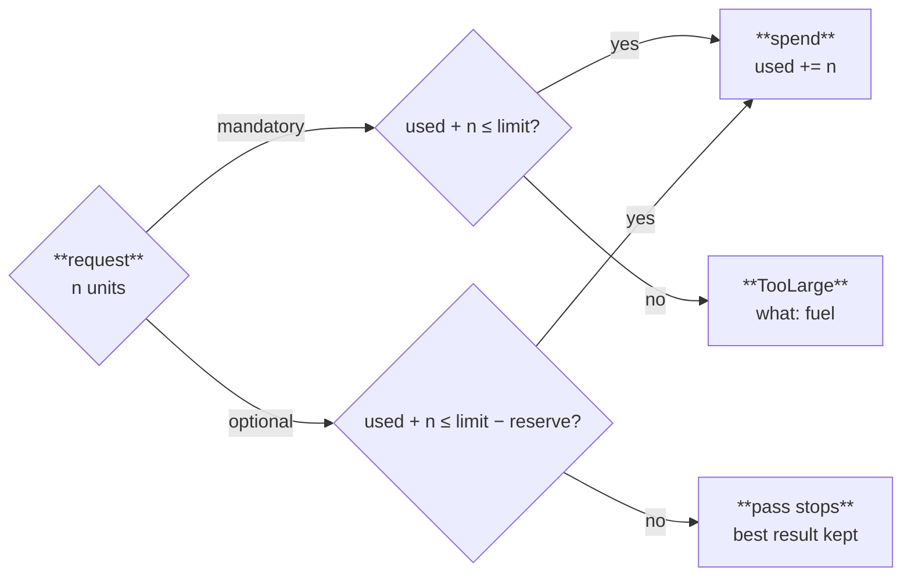

`render(source, options)` never panics and never runs unbounded. Every step either checks a size limit or draws from one per-diagram fuel counter, and a failure comes back as a result with an error and diagnostics, never as an exception from the core.

## One render, end to end

```mermaid
flowchart LR
  accTitle: One render with its limits
  src["**source**<br/>check input ≤ 1 MiB"] --> parse["**parse**<br/>nesting ≤ 64, labels ≤ 4 KiB"]
  parse --> caps["**size caps**<br/>≤ 2,000 nodes, ≤ 4,000 edges"]
  caps --> hint["**parse hint**<br/>1 optional unit per byte"]
  hint --> measure["**measure labels**<br/>1 unit per byte"]
  measure --> p12["**phases 1–2**<br/>cycles, layers ≤ 500"]
  p12 --> build["**layered graph**<br/>nodes + dummies ≤ 20,000"]
  build --> p3["**phase 3 sweeps**<br/>mandatory"]
  p3 --> refine["**phase 3 refinement**<br/>exact + local objective"]
  refine --> rest["**phases 4–7**<br/>coordinates, routing, labels"]
  rest --> fit["**container fit**<br/>alternatives while fuel lasts"]
  fit --> draw["**draw**<br/>SVG + outline"]
  big["**TooLarge**<br/>E004, CLI exit 3"]
  src e1@--> big
  build e2@--> big
  p3 e3@--> big
  class draw accent
  class refine,fit,hint optional
  class big danger
  class e1,e2,e3 failure
```



Dashed boxes are optional work: when fuel runs short they stop and keep the best result so far. Every other step is mandatory; a limit or an empty fuel counter there ends the render with `TooLarge`. The failure edges show three representative exits; every mandatory step has one.

## Limits

| Limit | Default | Exceeded |
|---|---|---|
| Input size | 1 MiB | `TooLarge { what: "input" }` |
| Declared nodes / edges | 2,000 / 4,000 | `TooLarge { what: "nodes" }` / `"edges"` |
| Layers | 500 | `TooLarge { what: "layers" }` |
| Layered graph: nodes plus dummy nodes | 20,000 | `TooLarge { what: "layered nodes" }` |
| Subgraph / front matter / `%%{init}%%` nesting | 64 | `E010` / `E011` / `E012` error |
| Label length | 4,096 bytes | Truncated at a character boundary, `W012` |
| Fuel | 20,000,000 units | Optional passes stop; a mandatory phase returns `TooLarge { what: "fuel" }` |

Every limit is a render option (`Limits` in `crates/merlion-render/src/options.rs`). The dummy-node cap exists because an edge spanning L layers adds L − 1 dummies: 2,000 nodes with 2,000 long edges would otherwise reach 4 million.

## Fuel

One fuel unit is one step of an inner loop: one node visited in cycle removal, one neighbour scanned in a sweep, one search node in exact refinement, one byte of label text measured. The counter lives in `crates/merlion-render/src/fuel.rs` and has two ways to spend:

- `burn` — mandatory work. It may use every unit up to the limit; running out is `TooLarge`.
- `burn_optional` — optional work. It fails, without spending, once only the **reserve** is left.

Before phase 3, the layout computes the reserve from the layered graph's size (64 units per node, segment and chain, plus 4,096) and holds it back for coordinates, routing and labels. So an optional pass can never starve a mandatory one, and a diagram that fits its budget always renders.



Fuel replaces a time budget because a clock would make output depend on machine load; with fuel, the same input and options render the same bytes on a loaded CI runner and on a laptop ([ADR-0008](/reference/specs/adr/0008-deterministic-work-budget/)). Container fit spends fuel the same way: it tries another alternative only while the fuel left covers one more candidate the size of the first drawing ([Container fit](/how-it-works/layout/container-fit/)).

## Result

The CLI's `--json` and the WASM module emit the same JSON, written by `crates/merlion-render/src/json.rs`:

```json
{ "svg": "<svg …>", "outline": "Flowchart, left to right. …", "diagnostics": [], "fuel_used": 18342, "error": null }
```

| `error` | Meaning | Diagnostic |
|---|---|---|
| `null` | Rendered; `svg` and `outline` are set | Warnings, repairs and infos only |
| `{ "kind": "parse" }` | The source failed to parse | `E002` or the parser's own error |
| `{ "kind": "unsupported_diagram", "header": "pie" }` | Not a flowchart | `E003` |
| `{ "kind": "too_large", "what": "layers" }` | A limit or mandatory fuel ran out | `E004` |
| `{ "kind": "internal" }` | WASM only: the module trapped; the glue replaces the instance | `E001` |

The JavaScript glue converts names to camelCase (`fuelUsed`, `byteStart`). The CLI exits `0` when every diagram rendered, `1` when one failed, `2` on a usage error and `3` when an input exceeded a limit. How to read and repair diagnostics: [Diagnostics and repairs](/guides/diagnostics/).
