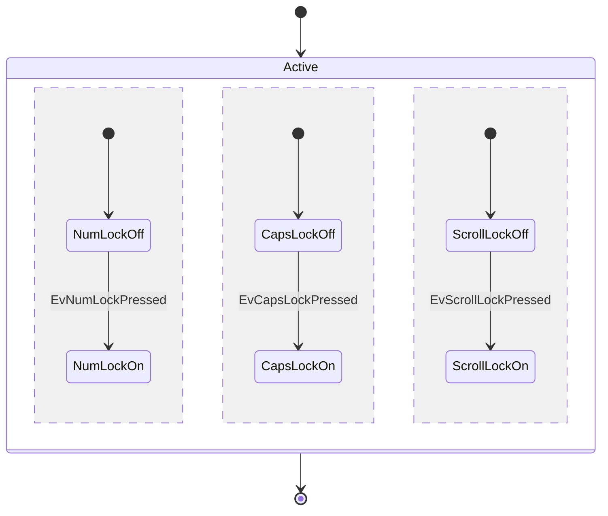

A state machine is graph-shaped: states are vertices, transitions are edges, composite states are containers. That is the shape the layered engine already takes, so Merlion gives state diagrams no layout engine of their own. `layout::state::lower` turns a `StateMachine` into the `Flowchart` the engine expects, plus the maps back to the model, and `layout_flowchart` runs over it unchanged.

```mermaid
flowchart TB
  accTitle: A state machine lowers to a flowchart graph and runs the flowchart pipeline
  src["`stateDiagram-v2`<br/>source"]
  sm["**StateMachine**<br/>states, transitions, notes, regions"]
  low["**lower**<br/>nodes, edges, clusters"]
  phases["**The layered engine**<br/>seven phases, unchanged"]
  notes["**place_notes**<br/>split each reserved extent"]
  svg["**SVG**<br/>class merlion-state"]
  src --> sm --> low --> phases --> notes --> svg
  sm e1@-.->|"ids, kinds, labels"| svg
  class sm accent
  class low,notes store
  class svg output
  class e1 async
```

The dashed line is the reason the model survives the trip: the SVG names what the source named, and the text alternative reads the machine rather than the graph, so `[*]` prints as `start` and a transition into a composite state prints that state's name. Everything else goes through the lowering.

## What lowers to what

| Model | Lowered as |
|---|---|
| Simple state | Node, rectangle, label the description |
| Composite state with members | Cluster, title the description; members lowered inside it |
| Composite state with no members | Node, rectangle, so a transition naming it lands somewhere |
| Choice | Node, rhombus, empty label: a diamond at the minimum node size |
| Fork, join | Node, the 70 × 10 bar, drawn without a label |
| Start | Node, a 14 px filled disc |
| End | Node, a 20 px ring around a disc |
| Concurrency region | Cluster nested in its composite's cluster, empty title |
| Transition | Edge, normal stroke, arrowhead at the target, label the transition text |
| Note | Not a graph element at all — see [Notes](#notes) |

## What the lowering guarantees

The engine has requirements that a hand-built graph can violate. Five of the six guarantees below exist to meet them; the first exists so that the layout hint and the `data-merlion-id` attributes keep working across an edit.

1. **Ids are injective and stable.** A declared state keeps its source id. `[*]` becomes `{scope}_start` or `{scope}_end` — `root_start` at the top level, `Active_r1_end` in the second region of `Active` — and a clash with a declared id appends `_` until the id is free. The same source always gives the same ids, so a re-render matches the previous one node for node.
2. **Order is the source's.** Nodes follow state declaration order and edges transition order, so the entry choice of phase 1 and the tie-breaks of phase 3 are fixed by the source. An edit moves only what it must.
3. **A parent precedes its children.** A composite is listed before its regions, and a region before the composites inside it, which is what the cluster builder requires.
4. **Every node names its innermost cluster.** A state inside a region carries the region, never the composite above it, so the boxes nest as the source nests.
5. **Every edge has two node endpoints.** A transition naming a composite state connects to the cluster, which the graph represents by the cluster's first member, and a transition between a composite and one of its own members is dropped — the same two rules a flowchart subgraph endpoint follows.
6. **A note never enters the graph.** It changes one node's measured extent and nothing else, so the layered graph's node count, layer count and crossing count are identical with and without notes.

## What each phase does here

Every option and every phase of the [layout engine](/how-it-works/layout/cycle-removal/) applies unchanged. What changes is only what a state machine feeds them.

| Phase | On a state machine |
|---|---|
| [Cycle removal](/how-it-works/layout/cycle-removal/) | A machine is a control-flow graph, so it takes the flowchart path: the dominator tree from the virtual root, back-edges reversed, a greedy feedback arc set for the rest. `A --> A` is a self-loop and is routed, not layered |
| [Layer assignment](/how-it-works/layout/layer-assignment/) | Longest-path layering, `min_len` 1 on every transition. The start state has no predecessor, so it sinks to one layer above its successors and sits next to the state it enters |
| [Crossing minimisation](/how-it-works/layout/crossing-minimisation/) | All three passes, unchanged |
| [Coordinate assignment](/how-it-works/layout/coordinate-assignment/) | Brandes–Köpf, unchanged |
| [Container fit](/how-it-works/layout/container-fit/) | All five steps, wraps and layer splits included; a transition crossing a wrap is marked as one |
| [Edge routing](/how-it-works/layout/edge-routing/) | Orthogonal by default; a transition label takes the edge-label chip and its placement rules |
| [Clusters](/how-it-works/layout/edge-routing/#clusters) | Composite states and regions are clusters: members occupy a contiguous span per layer, the box pads them by 12 px plus the title height, and a transition across the boundary enters through a port |
| [Stable layout](/how-it-works/layout/stable-layout/) | The hint is read and written, keyed by lowered node id. This is the visible difference from sequence diagrams, which write a hint and never read one |

A layered graph is drawn with its layers along one axis, so a concurrency region is simply a cluster whose members happen to have no edge leaving it. Nothing in the engine knows that the three regions below run at the same time; the dashed dividers and the `--` in the source are what says so.



## Notes

A note is geometry, not a vertex, so no layout phase changes for it. The lowering inflates its state's measured extent along the order axis — left for a `note left of`, right for a `note right of` in `TB` and `BT`, above and below in `LR` and `RL` — by the gap plus the note's width, and the engine reserves that rectangle like any other part of the node. After layout, `place_notes` splits the laid-out box: the state's own rect keeps its measured size at the far end and the note takes its width at the near end, centred across the state.

| Constant | Value |
|---|---|
| Padding inside a note box | 10 × 8 px |
| Gap from the state's rect to the note | 16 px |
| Wrap width of note text | 180 px |
| Gap between two notes on one state | 8 px |

Because the space comes out of the node's own extent, a note box can overlap no node, no cluster title and no routed edge: the layout already treats that rectangle as occupied. Placing it on the order axis and never on the layer axis also keeps it clear of the ports a transition attaches to, which sit on the layer-axis sides of a node in every direction.

## Roles, tones and fuel

The lowered graph is what the role and tone rules see, which is why a state diagram needs no tone rule of its own: a choice is a rhombus, so it takes `warn`; a top-level composite state is a subgraph, so it takes the next series tint; everything else stays neutral. A `classDef` written in the source reaches the lowered node or cluster the same way.

Fuel is charged before the lowering allocates: one unit per state, transition, note and region, then the flowchart pipeline's own charges on the graph that comes out. Running out in a mandatory phase returns `TooLarge`; an optional pass stops and keeps the result it had.

The design and its trade-offs are in [state.md](/reference/specs/state/#lowering); the shape it lowers into is in [layout.md](/reference/specs/layout/).
