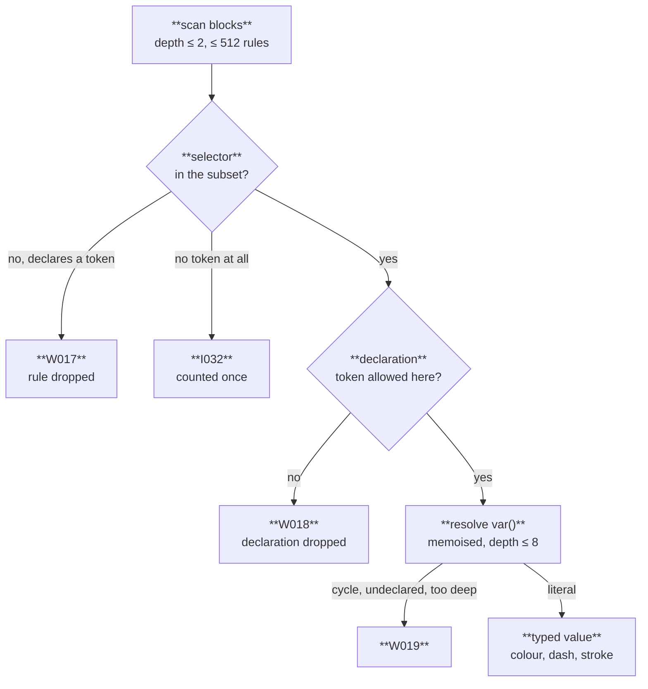

A Merlion stylesheet is a CSS subset that sets `--merlion-*` tokens and nothing else. The core parses it into a typed `Stylesheet`, and the model has two emitters: page CSS for diagrams inlined on a web page, and a `Palette` baked into a standalone SVG. Browsers never see the author's CSS text, only Merlion's re-serialisation of the model, so an untrusted stylesheet can at worst set typed colours on Merlion diagrams ([ADR-0009](/reference/specs/adr/0009-stylesheet/)).

## Compile once, emit twice

```mermaid
flowchart LR
  accTitle: Stylesheet compile and bake
  css[/"**diagram.css**<br/>CSS subset, ≤ 64 KiB"/] --> compile["**compile**<br/>stylesheet::compile"]
  compile --> model["**Stylesheet**<br/>themes, role rules, resolved values"]
  compile e1@--> e013["**E013**<br/>a limit exceeded, no output"]
  model --> tocss["**to_css**<br/>merlion css, compileStylesheet"]
  model --> palette["**palette(theme, auto_dark)**<br/>render --css --theme"]
  tocss --> page["**page CSS**<br/>literals, fixed selectors"]
  palette --> baked["**baked SVG**<br/>literals in attributes and fallbacks"]
  page e2@-.-> inline["**inline SVG**<br/>rendered without a palette"]
  class css style
  class compile accent
  class model store
  class page,baked,inline output
  class e013 danger
  class e1 failure
  class e2 async
```

| Emitter | Command | JavaScript | Used for |
|---|---|---|---|
| Page CSS | `merlion css site.css -o site.compiled.css` | `compileStylesheet(css).css` | Linked on the page after `merlion-themes.css`; inline diagrams follow the cascade and switch theme with no re-render |
| Palette | `merlion render d.mmd --css site.css --theme dark` | `render(src, { palette: compileStylesheet(css, { theme: "dark" }).palette })` | Standalone files, GitHub image embeds, librsvg |

The rehype plugin and the Astro integration compile the `stylesheet` option once per build and link the page CSS; inline renders never receive a palette. This site does exactly that with `docs/src/styles/diagrams.css`, which maps the roles to Starlight's colours.

## Inside the compiler



- **Selectors.** `:root`, `[data-theme="<t>"]`, `:root:not([data-theme])` inside `@media (prefers-color-scheme: dark)`, `.merlion-c-<name>`, `.merlion-cc-<name>`, and role selectors under a named theme. Lists of up to 8.
- **Declarations.** Theme selectors set colour tokens, `--merlion-c-<name>-fill|stroke|color`, `--merlion-stroke` and private `--<ident>` colours; role selectors set `--merlion-tone` and `--merlion-dash` only. `--merlion-font` and `--merlion-font-size` are rejected, because they are measurement inputs and a free family name can fetch a font.
- **Values.** A literal (hex, `rgb()`, `hsl()`, `oklab()`, `oklch()` inside sRGB, named colours) or `var(--name[, literal])` naming a token of the same file. A reference resolves in the theme of its rule: the theme's own block over `:root`. `color-mix()`, `calc()`, `url()`, `!important`, quoted strings and escapes are `W018`.
- **Limits.** 64 KiB, 512 rules, 32 declarations per rule, 16 themes, 256 role selectors, block depth 2, 64 KiB of output. Any one exceeded is `E013` and nothing is emitted. `--strict` turns `W017`–`W019` into errors.

Parsing and resolution are linear in the input and run once per invocation, outside every render's fuel counter.

## Page CSS

`to_css` writes literal values under fixed selector shapes: `:root`, `[data-theme="<t>"]`, the media block, and role selectors prefixed with `.merlion ` (`.merlion .merlion-c-queue`). The prefix adds the same specificity to every role rule, so their order is the source's. Compiling compiled output yields the same bytes.

## Palette

`palette(theme, auto_dark)` resolves one theme into literals: every foundation and role token, mixed roles recomputed from the resolved `--merlion-bg` and `--merlion-fg` with the core's software `oklab_mix`, and per-role tone and dash literals. Draw puts each literal in three places, the presentation attribute, the innermost `var()` fallback and the fallback outside `@supports`, so a browser with no host CSS, a renderer that ignores custom properties and librsvg all draw the same colour. With `--auto-dark`, the SVG adds one `prefers-color-scheme: dark` block with the dark literals.

A palette never declares a custom property, so a page that inlines a baked SVG still themes it. It never touches layout: a baked SVG has the same geometry and layout hint as the plain one, and, without an `idPrefix`, only its id changes, because the palette's digest joins the id hash. The benchmark's parity gate checks that the plain SVG with page CSS and the baked SVG in Chrome and rsvg-convert draw every element within ±1 per channel.

Writing a stylesheet: [Roles and stylesheets](/guides/roles-and-stylesheets/). The grammar: [specs/svg-output.md](/reference/specs/svg-output/#stylesheet).
