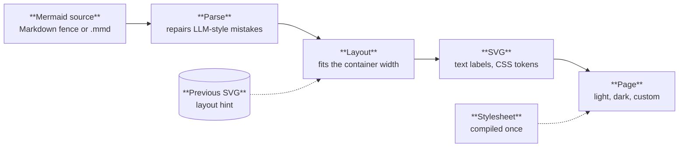

Merlion renders Mermaid flowcharts to static, themeable, accessible SVG. The core (`crates/merlion-render`) is a `no_std` Rust library with zero dependencies; the same code runs as the `merlion` CLI and as a WebAssembly module, and native and WASM output are byte-identical. Labels are `<text>`, colours are CSS custom properties, so light, dark and custom themes switch with CSS alone, and every SVG carries `role="img"`, a `<title>` and a generated `<desc>`. The output is safe to inline without a sanitiser.

Every diagram on this site, the one above included, is a ```` ```mermaid ```` block that Merlion renders at build time through the Astro integration. Switch the theme in the header: the diagrams restyle through CSS, with no re-render.

## Guarantees

| Property | Contract |
|---|---|
| Output | One self-contained SVG per diagram: labels are `<text>`, colours are CSS custom properties over presentation-attribute defaults, with `role="img"`, `<title>` and a generated `<desc>` |
| Safety | The SVG can be inlined without a sanitiser even when the source or the stylesheet is untrusted: no scripts, no source or stylesheet CSS text, no selectors that reach the host page |
| Theming | Light, dark and custom themes switch by CSS alone; there is no re-render. One stylesheet themes roles and `classDef` colours on the page and, baked, in standalone SVG |
| Runtime | Renders without a DOM or a browser; server and browser output are byte-identical for the same source, options and layout hint |
| Dependencies | 0 runtime crates and 0 runtime npm packages |
| Stability | Given the previous render as a layout hint, nodes that keep their layer across an edit keep their order and move at most `stability` (default 2) positions; the hint is dropped when fewer than half the nodes survive |
| Fit | Layout takes the container width as an input and fits it |

## Benchmark

The compat corpus holds the 390 flowcharts of the mermaid repository at tag `mermaid@12.0.0`, plus 106 one-line edit pairs for stability. Numbers are means unless marked; lower is better except for the rendered and fit rows. Source: `bench/results/2026-09-22-round2.md`, Merlion at commit `5392e69`, all three renderers run on 2026-09-22.

| Metric | Merlion | mermaid-dagre | mermaid-elk |
|---|---|---|---|
| Rendered | 384/390 | 389/390 | 389/390 |
| Fits 720 px | **98.2%** | 81.0% | 82.3% |
| Crossings | 0.10 | 0.20 | 0.05 |
| Total edge length (px) | 644 | 562 | 631 |
| Area (px²) | **99k** | 197k | 183k |
| Label overlaps | **0** | 0.010 | 0.010 |
| Stress | 0.0719 | 0.068 | 0.076 |
| Stability after an edit, mean / p95 | **0.054 / 0.253** | 0.059 / 0.311 | 0.060 / 0.258 |
| Native vs WASM | 384/384 byte-identical | – | – |

Render time is 0.19 ms at p50 and 0.76 ms at p95 per diagram, single run, native. The six diagrams Merlion does not render stop at an `E002` syntax error; other diagram types return `E003`. Method and every metric: [the benchmark spec](/reference/specs/benchmark/).

## Where to go

| Page | What it covers |
|---|---|
| [Getting started](/getting-started/) | CLI, WebAssembly, rehype and Astro, with the same commands as the README |
| [Guides](/guides/theming/) | Theming, roles and stylesheets, title + detail labels, stable layout, the viewer, diagnostics |
| [How it works](/how-it-works/architecture/) | Packages, the render pipeline and each layout phase as flowcharts |
| [Playground](/playground/) | A live editor over the WebAssembly build |
| [Gallery](/gallery/) | Every test fixture, the showcase and twelve mermaid corpus diagrams |
| [Specs](/reference/specs/) | The design documents and decision records, read-only |
