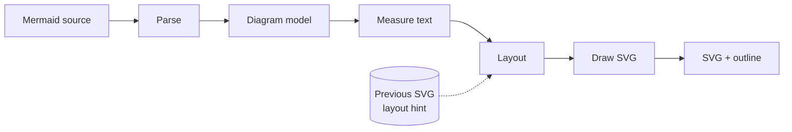

# Architecture

## Pipeline

Every stage is a pure function of its inputs; no stage reads the clock, the environment or the filesystem. Identical source, options and layout hint produce byte-identical SVG on every target ([Determinism](#determinism)).

| Stage | Input | Output | Spec |
|---|---|---|---|
| Parse | UTF-8 source, parse options | Diagram model plus diagnostics | [parser.md](parser.md) |
| Measure | Diagram model, font table | Size of every label box | [text-measurement.md](text-measurement.md) |
| Layout | Sized model, layout options, optional hint | Geometry: node boxes, edge paths, cluster boxes | [layout.md](layout.md) |
| Draw | Geometry, draw options | SVG string, plain-text outline | [svg-output.md](svg-output.md) |

The stylesheet compiler is outside the pipeline: `stylesheet::compile` turns CSS text into a typed `Stylesheet` once per invocation, and a render receives only the resolved `Palette` ([ADR-0009](adr/0009-stylesheet.md)). The palette reaches Draw alone; it never affects measurement, layout or the layout hint.

The diagram model is one tagged enum per diagram type (`Flowchart`, `Sequence`, `State`, `Class`, `Er`, `Gantt`, …). Graph-shaped types (flowchart, state, class, ER) lower to a shared `LayeredGraph` and share one layout engine. Types with a fixed geometry (sequence, gantt, timeline, pie, XY, packet, kanban) have their own layout modules and do no graph layout.

## Packages

| Package | Kind | Contents |
|---|---|---|
| `merlion-render` | Rust library (crates.io), `#![no_std]` + `alloc` | Parse, measure, layout, draw; the stylesheet compiler. No I/O. |
| `merlion-cli` | Rust binary (crates.io); the installed command is `merlion` | Argument parsing, file and stdin I/O, reading layout hints from files |
| `merlion-wasm` | Rust `cdylib` → `.wasm`, `publish = false` | Raw `extern "C"` exports over the core; ships only inside `@fractalboxdev/merlion-wasm` |
| `@fractalboxdev/merlion-wasm` | npm | The `.wasm` file plus hand-written JS glue and `.d.ts` |
| `@fractalboxdev/merlion-rehype` | npm | rehype plugin over `@fractalboxdev/merlion-wasm` |
| `@fractalboxdev/merlion-astro` | npm | Astro integration registering the rehype plugin |
| `@fractalboxdev/merlion-view` | npm | `<merlion-view>` web component, independent of the renderer |
| `tools/fontgen` | Rust binary, not published | Generates the committed font metric tables |
| `bench/` | Not published | Benchmark harness ([benchmark.md](benchmark.md)) |

### Naming conventions

| Surface | Pattern | Examples |
|---|---|---|
| npm package | `@fractalboxdev/merlion-<part>` | `@fractalboxdev/merlion-wasm`, `@fractalboxdev/merlion-rehype` |
| Rust crate | `merlion-<part>` (crates.io has no scopes) | `merlion-render`, `merlion-cli` |
| Command | `merlion` | `merlion render`, `merlion check` |
| Custom element | `merlion-<name>` | `<merlion-view>` |
| CSS custom property | `--merlion-<role>` | `--merlion-node-bg` |
| CSS class | `merlion-<thing>` | `merlion-node`, `merlion-zoomed-out` |
| Data attribute | `data-merlion-<key>` | `data-merlion-layout` |
| Diagnostic code | `E0xx` / `W0xx` / `R0xx` / `I0xx` | `R002` |

`<part>` names one deliverable (`wasm`, `rehype`, `astro`, `view`, `render`, `cli`), never a version or a platform. The unscoped names `merlion` (crates.io and npm) and `merlion-core` (crates.io) belong to unrelated projects.

## Targets

- **Build time, the primary target.** The CLI or `@fractalboxdev/merlion-rehype` renders at build time; pages ship SVG and no renderer.
- **Browser, secondary.** `@fractalboxdev/merlion-wasm` serves live editors, previews and diagrams written at runtime, e.g. by an LLM in chat ([ADR-0003](adr/0003-prerender-first.md)).

## Determinism

Byte-identical output on x86-64, arm64 and wasm32 rests on these rules:

- **No clock.** Work limits are counted in fuel units, never in time ([ADR-0008](adr/0008-deterministic-work-budget.md)).
- **Arithmetic.** Geometry is `f64`. `+ − × ÷` are correctly rounded by IEEE 754 on every target, and Rust never contracts them into FMA. On stable Rust, `sqrt`, `atan2`, `sin`, `cos` and `hypot` live in `std`, not `core` (the `core` versions are unstable behind `core_float_math`, [rust-lang/rust#137578](https://github.com/rust-lang/rust/issues/137578), as of 2026-09-22), and zero runtime dependencies rules out `libm`. The core implements them in software from integer and basic float operations: `sqrt` correctly rounded (the same result as the hardware instruction), the others to a documented error bound. The results are therefore identical on every target. When `core_float_math` stabilises on the pinned toolchain, `sqrt` switches to the `core` method, which is also correctly rounded, and the others stay in software because their standard-library results may differ by target.
- **Output numbers.** Every coordinate is rounded to 1/100 px and printed by the core's own formatter: no exponent form, no trailing zeros, `-0` printed as `0`. The SVG text is canonical even when accumulated rounding differs in the last bit.
- **Colour.** Palette mixes use the core's `oklab_mix`: sRGB↔linear through a 256-entry constant table and its binary-search inverse, `cbrt` by Newton iteration from a fixed seed, `oklch()` hue through the software `sin`/`cos`. No `powf`.
- **Collections.** Only `Vec`, `BTreeMap` and `BTreeSet`; no hashed collection, so no iteration order depends on a seed.
- **Enforcement.** CI renders the whole `compat` corpus natively and under wasmtime and Node, and fails on any byte difference.

## Boundaries

| Limit | Default | Exceeded |
|---|---|---|
| Input size | 1 MiB | `TooLarge` |
| Declared nodes / edges | 2,000 / 4,000 | `TooLarge` |
| Layered graph: nodes plus dummy nodes, after layer assignment | 20,000 | `TooLarge` |
| Layer count | 500 | `TooLarge` |
| Nesting depth: subgraphs / front matter / `%%{init}%%` | 64 | `Error` `E010` / `E011` / `E012` ([parser.md](parser.md#codes)) |
| Stylesheet size / rules / declarations per rule / compiled output | 64 KiB / 512 / 32 / 64 KiB | `Error` `E013` |
| Stylesheet theme names / role selectors / block depth | 16 / 256 / 2 | `Error` `E013` |
| Stylesheet `var()` resolution depth | 8 | `Warning` `W019` |
| Embedded style added by a palette, per diagram | 16 KiB | Unused roles never embedded; roles over the cap dropped with `W017` |
| Classes per node, edge or cluster | 32 | Dropped with `W020 ClassesTruncated` |
| Label length | 4,096 bytes | Truncated at a character boundary with `W012 LabelTruncated` |
| Fuel per diagram | See [ADR-0008](adr/0008-deterministic-work-budget.md); role work is charged before layout, one unit per class on an element and per palette tone | Optional passes stop; exhaustion in a mandatory phase returns `TooLarge` |

- Every limit is configurable by the caller. The dummy-node limit exists because an edge spanning L layers adds L − 1 dummy nodes: 2,000 nodes and 2,000 long edges would otherwise reach 4 million.
- The core has no panics on any input, and no unbounded recursion: every recursive parser carries a depth counter. A fuzz target covers each parser separately and the whole pipeline ([security.md](security.md#fuzzing)).
